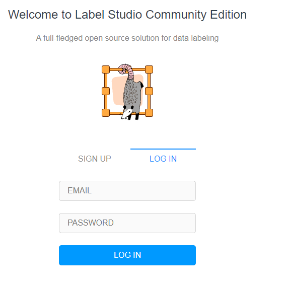

# EFREI-CAMP setup tutorial <a name="home"></a>

## These are the prequisites you need to setup / install in your environment before the Hackaton day

### Software
1. Docker : 

    1. Install : [installation link](https://docs.docker.com/get-docker/)
    2. Test / Check if your docker is functioning:
    ```
    docker pull heartexlabs/label-studio:1.4.0
    cd labelstudioUI
    docker run -it -p 9999:9999 -v "%cd%"/mydata:/label-studio/data heartexlabs/label-studio:1.4.0 /bin/bash -c "label-studio start --port 9999"
    ```
    - For Linux / Mac, you need to change `%cd%` with `$pwd` or `$PWD`
    
    Note : for Windows, if Docker doesn't work, some tips :
    - Free memory in your laptop, if you have only 8gb of ram, make sure to close or unused apps
    - Go to Docker settings and reduce cpu and Ram and restart
    - you may need to activate virtualization in the Bios (if not activated):
        - Check this url https://2nwiki.2n.cz/pages/viewpage.action?pageId=75202968

    - Make sure Labelstudio app is accessible http://localhost:9999 (check screen below)


2. One Gmail account per user (will be used when working with COLAB)
 - Make sure you have free space in Google Drive if you do training on COLAB (at least 8 Gb)

3. Setup Python Env in local PC - open new terminal, inside the Repo path, run these lines (one by one) :
    ```
    conda create -n labelstudioml python=3.8
    conda activate labelstudioml
    conda install nb_conda
    pip install jupyter git+https://github.com/amtam0/flair.git tensorboard
    cd ML_backend/label-studio-ml-backend
    pip install -U -e .
    ```
    - Check if notebook is running locally and is able to connect to your `labelstudioml` py env :
    ```
    conda activate labelstudioml
    jupyter notebooks
    ```
4. `Ngrok` will be used to convert local url to https for free, it will be used to share Web-app and Model's Api during labelling and evaluation process

    - You need to create `2 to 3 different accounts` per Team (1 acount per email) from this [LINK](https://ngrok.com/)
        - Validate your Ngrok verification by email
        - Download Ngrok depending on your OS, and add it to the home Repo

### Hardware (local PC)
- 8 Gb of Ram
- 20 Gb free disk space
